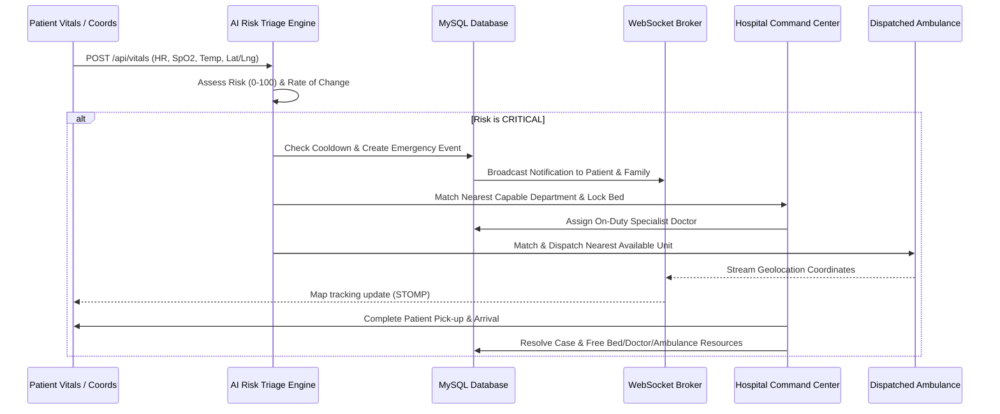

# VitalGuard — Smart Health Monitoring & Emergency Command System

VitalGuard is a comprehensive, real-time AI-assisted vital monitoring and emergency response system. The platform orchestrates real-time patient telemetry ingestion, rules/rate-of-change AI health risk assessments, automated hospital capability routing, specialist doctor allocation, family alert broadcasts, and live simulated ambulance dispatch tracking.

---

## 🏗️ Architecture & Stack

The platform is organized into three decoupled layers:

1. **Backend (Java Spring Boot)**:
   - Framework: Spring Boot 3.x, Spring Security (JWT), Spring Web, Spring Data JPA.
   - Database: MySQL (with JPA/Hibernate automatic database seeding).
   - Messaging: SockJS and STOMP WebSocket broker.
2. **Frontend (React Vite)**:
   - Framework: React 18, Vite, React Router, Axios.
   - Map: Leaflet (interactive coordinates tracking).
   - Styling: Modern CSS custom variables layout with soft lavender background and clean SaaS cards.
3. **Simulator (Python)**:
   - Scenario validation scripts using `requests` and `websocket-client` libraries.
   - Automatically tests patient vitals ingestion, intelligent SOS triage routing, and real-time STOMP coordinate logs.

---

## 🚀 Complete Ecosystem Flow



---

## 🛠️ Installation & Setup

### Prerequisites
- Java 21+
- Node.js 18+
- MySQL Server (running on `localhost:3306` with database `vitalguard`)
- Python 3.9+ (for integration checks)

### 1. Run the Spring Boot Backend
Ensure your MySQL database credentials are configured in `backend-java/src/main/resources/application.properties`, then run:
```bash
cd backend-java
./mvnw spring-boot:run
```
The backend initializes the database schema, seeds test hospitals, departments, doctors, ambulances, and runs on `http://localhost:8000`.

### 2. Run the React Frontend
```bash
cd frontend
npm install
npm run dev
```
The React development server runs on `http://localhost:5173`.

### 3. Run Integration Scenario Tests
```bash
cd simulator
python3 -m venv venv
source venv/bin/activate
pip install numpy requests python-dotenv websocket-client
python verify_all_scenarios.py
```

---

## 🔌 WebSocket Topics & Mappings

The platform relies on the SockJS endpoint `/ws` for real-time STOMP communications:

- **`/topic/vitals/{patientUid}`**: Streams incoming vital metrics to the patient's card.
- **`/topic/family-notifications/{patientId}`**: Broadcasts critical alert card updates to family screens.
- **`/topic/emergency/{id}`**: Streams coordinates, ETA progress, and state transitions for active ambulance tracking.
- **`/topic/emergency-updates`**: Signals doctor and hospital command centers of active case changes.
- **`/topic/hospital-queue-refresh`**: Refreshes operations queues for department managers.

---

## 📂 Project Directory Structure

```
Vital-Guard-main/
├── DEPLOY.md               # Production deployment instructions
├── HOW_TO_RUN.md           # Developer run command summary
├── README.md               # Comprehensive platform guide
├── android_apps/           # Native Android client app sources
├── backend-java/           # Spring Boot backend application
├── docs/                   # System requirements & specifications
├── frontend/               # React Vite dashboard web application
├── mobile/                 # Flutter mobile app sources
└── simulator/              # Python integration tests & telemetry simulator
```
